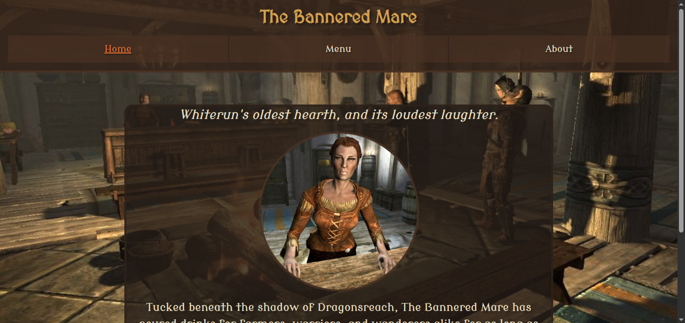

# Restaurant Page

A fictional restaurant page for The Bannered Mare, an inn inspired by the world of Skyrim. Built as a project for [The Odin Project](https://www.theodinproject.com/lessons/node-path-javascript-restaurant-page)'s Full Stack JavaScript course.

The site is a single-page application with three views, Home, Menu, and About, rendered dynamically via JavaScript, with navigation handled entirely client-side.

## What I Learned
Quite honestly, something I did that I did not expect to work the way it did, was using a base style file `base.css`, declaring variables within it and being able to access them from my other page specific css files without importing `base.css` into each one directly.

I understand now it's because CSS custom properties aren't scoped per-file the way JS module imports are. Once `base.css` is loaded anywhere in the bundled stylesheet, its `:root` variables are globally available. I'd *hoped* it would work this way, but wasn't confident it actually would until I tested it.

Though I've not worked with JSON files yet as part of The Odin Project's curriculum, I decided to try it here and used `menuData.json` to hold my menu items. My initial method was two arrays of objects directly inside `menu.js`, but I didn't like that it mixed my content with my logic and made the file unnecessarily long. Separating the two made `menu.js` easier to read and the menu content easier to update independently.
